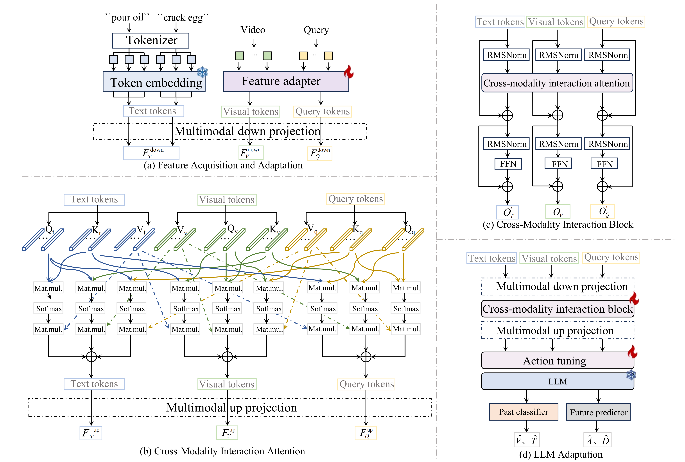
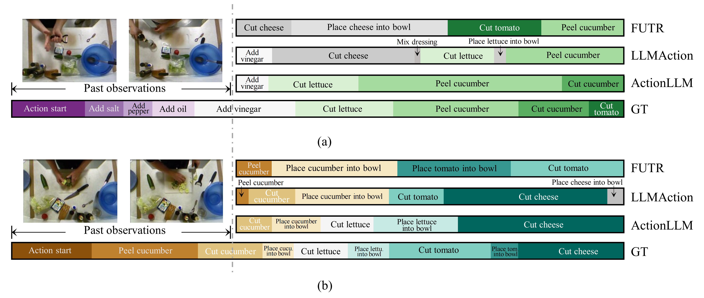

# Multimodal Large Models Are Effective Action Anticipators

This repository is the official implementation of ActionLLM. In this study, we introduce the ActionLLM, which leverages Large Language Models (LLMs) to anticipate long-term actions by treating video sequences as successive tokens. By simplifying the model architecture and incorporating a Cross-Modality Interaction Block, it enhances multimodal semantic understanding and achieves superior performance on benchmark datasets. Paper from [currently no paper]().


<div style="text-align:center">

</div>

## Environmental setup
* Conda environment settings:
```bash
conda env export > actionllm.yaml
conda activate actionllm
```

## Data
* Download the datasets from https://mega.nz/file/O6wXlSTS#wcEoDT4Ctq5HRq_hV-aWeVF1_JB3cacQBQqOLjCIbc8 .   
* Download the LLaMA-7b from https://huggingface.co/nyanko7/LLaMA-7B/tree/main .
* Download the text_feature from https://pan.baidu.com/s/1nXMxt9-IrxGt-zvC1JV9XQ?pwd=iana .

Create a directory './data' for the two datasets and LLaMA-7B. Please ensure the data structure is as below:
```bash                        
    ├── data/                      
        ├── 50_salads/ 
        │   ├── groundTruth/
        │   ├── features/
        │   ├── mapping.txt
        │   └── splits/             
        ├── breakfast/ 
        │   ├── groundTruth/
        │   ├── features/
        │   ├── mapping.txt
        │   └── splits/                         
        ├── text_feature/ 
        │   ├── breakfast/
        │   └── 50_salads/  
        └── weights/ 
            └── 7B/      
                ├── checklist.chk
                ├── consolidated.00.pth
                ├── params.json
                └── ...       
```

## Training
* Please modify the address information in the .sh file and opts.py file according to your file location.
> ### 1. Breakfast
> ```bash
>./scripts/bf/train_bf.sh   
>```

> ### 2. 50salads
> ```bash
>./scripts/50s/train_50s.sh  
>```

## Testing
Download the checkpoint from https://pan.baidu.com/s/1P41BeTtxTebJP0OHXHXUSw?pwd=iana

> ### 1. Breakfast
> ```bash
>./scripts/bf/eval_bf.sh  
>```

> ### 2. 50salads
> ```bash
>./scripts/50s/eval_50s.sh  
>```

## Examples
<div style="text-align:center">

</div>


## Citation
If you find our code or paper useful, please consider citing our paper:
```BibTeX
@article{wang2025actionllm,
  title={Multimodal Large Models Are Effective Action Anticipators},
  author={Wang, Binglu and Tian, Yao and Wang, Shunzhou and Yang, Le}
  journal={IEEE Transactions on Multimedia},
  year={2025},
  publisher={IEEE}
}
```

## Acknowledgement
This repo borrows some data and codes from [LLaMA](https://github.com/facebookresearch/llama), [FUTR](https://github.com/gongda0e/FUTR?tab=readme-ov-file) and [LaVIN](https://github.com/luogen1996/LaVIN). Thanks for their great works.

